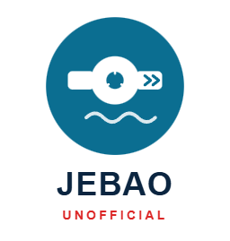

# Jebao Local Control

Local (no-cloud) control of Jebao aquarium pumps, wavemakers, dosing pumps,
lights and filters over LAN — a from-scratch reverse-engineering of the
Gizwits "GAgent" WiFi protocol these devices actually speak, plus a Home
Assistant integration built on top of it.

**Why this exists:** the official Jebao Aqua app requires a cloud account
and controls devices exclusively over MQTT-over-TLS to Gizwits' servers,
even when your phone and the pump are on the same LAN. This project
implements the *local* control path instead — the same UDP/TCP protocol
the pump's WiFi module (GAgent firmware) speaks on your own network, no
account, no cloud dependency, no internet outage taking your pump control
down with it.

## Status

| Capability | Status |
|---|---|
| LAN discovery (find pumps on your network) | ✅ Working, verified live |
| Read live status (power, mode, speed, faults, schedule) | ✅ Working, verified live |
| Write numeric attributes (flow %, frequency %, etc.) | ✅ Working, verified live |
| Write boolean/enum attributes (power on/off, mode, feed switch) | ✅ Encoding verified against real captured frames; power on/off confirmed live |
| Home Assistant integration | ✅ Built (`custom_components/jebao_local/`), not yet tested against a running HA instance |
| Coexists with other HA integrations | ✅ Verified against a second real integration ([`aipai-light-ha`](https://github.com/markosharknz1/aipai-light-ha)) - no domain/dependency conflicts, see [`tests/test_ha_integration_compat.py`](tests/test_ha_integration_compat.py) |
| Multi-product support | ✅ 29 WiFi-capable product schemas bundled (wavemakers, dosing pumps, lights, filters, pumps) - see [docs/SUPPORTED_MODELS.md](docs/SUPPORTED_MODELS.md) |
| Native Lovelace card | ✅ `custom:jebao-pump-card` - add from the card picker with zero YAML; auto-discovers your pumps and only shows the controls each one actually has |
| Tank dashboards | ✅ Example Lovelace dashboard + tank scripts ([`dashboards/`](dashboards/)) and a Control panel for managing several pumps at once (tank groups, cloneable settings profiles, feed mode with a timer) - both bundled inside the integration, no separate file copying |
| Bluetooth-only products | ❌ Out of scope - different (`var_len`) payload encoding, not implemented |
| Schedule programming (the 48 daily timer slots) | ❌ Decodable, not yet exposed as an HA entity |

See [SPEC.md](SPEC.md) for the full phase-by-phase build log (what was tried,
what worked, what didn't, in the order it happened) and
[METHODOLOGY.md](METHODOLOGY.md) for a readable account of *how* each piece
was actually figured out — this project involved real reverse engineering
(protocol analysis, static binary disassembly, and eventually reading a
debug log the vendor's own app happened to print), not just following a
public spec.

## Quick start (Python library)

```python
import asyncio
from jebao_gizwits.discovery import discover
from jebao_gizwits.session import GizwitsSession
from jebao_gizwits.schema import load_by_product_key  # or schema.load(path) for a raw JSON file
from jebao_gizwits.control import build_control_payload

async def main():
    devices = await discover()
    dev = devices[0]

    session = GizwitsSession(dev.ip)
    await session.connect()
    await session.authenticate()

    schema = load_by_product_key(dev.product_key)
    status = schema.decode_status(await session.read_status())
    print(status)

    # write, e.g. turn the pump off
    payload = build_control_payload(schema, {"SwitchON": False})
    await session.send_control(payload)

asyncio.run(main())
```

## Quick start (Home Assistant)

Copy `custom_components/jebao_local/` into your HA config's
`custom_components/` directory (or install via HACS as a custom repository),
restart HA, then **Settings → Devices & Services → Add Integration → Jebao
Local**. It'll offer to scan your LAN for pumps, or let you enter an IP
manually. See [custom_components/jebao_local/](custom_components/jebao_local/)
for architecture notes.

**Not yet tested against a live Home Assistant instance** - built and
validated for correct imports/API usage against the real `homeassistant`
package, and its core logic (schema-driven entity generation, write
encoding) is proven by the underlying library's live hardware tests, but
the integration itself (config flow UX, entity behavior end-to-end) hasn't
been exercised inside a running HA. Treat it as a strong starting point,
not a finished product - see [SPEC.md](SPEC.md) Phase 7 for context.

### Dashboards and the native card

Add a **Jebao Pump** card from Lovelace's own card picker (Edit dashboard →
Add Card → search "Jebao Pump") and it's done - no YAML, no entity picking.
It discovers every pump the integration knows about and only renders the
controls each one actually supports (power, wave mode, flow, frequency,
feed mode with a timer). Scope one to a specific pump with an optional
`dids: [...]` list if you want one card per tank.

`dashboards/jebao-dashboard.yaml` is a ready-made example dashboard using
that card, with pumps grouped into tank sections and an embedded Control
panel view; `dashboards/jebao-tank-scripts.yaml` adds one-tap tank-wide
on/off and a feed-mode script with a server-side auto-off timer. The
Control panel (a separate tool for managing *several* pumps at once - named
tank groups, settings profiles you save once and clone across a tank) is
also bundled in and served automatically at `/jebao_local/designer.html` -
no file copying, on HACS or a manual install alike. See
[dashboards/README.md](dashboards/README.md) for the full guide.

## Project layout

```
jebao_gizwits/              Core Python library (protocol, discovery, session, schema, control)
custom_components/jebao_local/   Home Assistant integration (vendors jebao_gizwits + bundles 29 product schemas)
  lovelace/jebao-pump-card.js    Native Lovelace card - auto-registered, zero YAML required
  panel/designer.html            Control panel: tank groups, cloneable settings profiles, feed timer
  panel.py                       Serves both of the above and registers the card/sidebar panel
  brand/                         Integration icon/logo, served automatically via HA's brands proxy (2026.3+) - no manifest changes needed
dashboards/                 Example Lovelace dashboard + tank scripts for grouping pumps by tank
fixtures/                   Real captured bytes used as ground truth (discovery replies, status reads, write frames)
  captured_writes/          Real write frames captured from the vendor app's own debug log - the ground truth for the write protocol
  product_schemas/          All 42 product schemas extracted from the vendor app (WiFi + Bluetooth)
tests/                      Offline regression tests against the captured fixtures - no hardware needed to run these
docs/
  SUPPORTED_MODELS.md        Every product this project's schema-driven approach could support, and how connectivity type is determined
  product_catalog.json       Same, machine-readable
  logo/                      Logo source SVGs and the GitHub social-preview image (manual upload only, GitHub has no API for it)
scripts/                    One-off diagnostic/setup scripts used during development (kept for reference)
SPEC.md                      Full build log, phase by phase, in the order things actually happened
METHODOLOGY.md                Readable writeup of the reverse-engineering approach
PHASE4B_PLAN.md               History of the bit-field write investigation specifically (the hardest part)
```

`tools/` (Ghidra, Android SDK, JDK, frida) and `reference/` (cloned
reference repos, decompiled APK) are gitignored - they're large (multi-GB)
and reproducible from documentation in SPEC.md, not meant to be versioned.

## Supported hardware

This project was built and verified against a Jebao wavemaker
(`本地造浪泵_WIFI_BLE`, product_key `54114ccdac1e41c0bb17e222887c07ba`). The
protocol implementation itself is schema-driven (not hardcoded to that one
product), and 29 WiFi-capable Jebao product schemas are bundled - see
[docs/SUPPORTED_MODELS.md](docs/SUPPORTED_MODELS.md) for the full list
(dosing pumps, lights, filters, other pumps). Byte-type writes and the
`SwitchON` bit-type write are confirmed working live; other bit-type
attributes on other products use the same confirmed formula but haven't
been individually tested - see the Status table above.

## Credits / prior art

- [`Apollon77/node-ph803w`](https://github.com/Apollon77/node-ph803w) - authoritative reference for GAgent transport framing, discovery, and the read/authenticate flow (same firmware family, different product)
- [`Mustavo/homebridge-clearlight-sauna`](https://github.com/Mustavo/homebridge-clearlight-sauna) - reference for the write-control command (also same firmware family)
- [`chrisc123/jebao_aqua-homeassistant`](https://github.com/chrisc123/jebao_aqua-homeassistant) and [`jrigling/homeassistant-jebao`](https://github.com/jrigling/homeassistant-jebao) - two earlier community Jebao HA integrations (cloud-dependent / older-hardware-targeted); this project's HA integration borrows architectural patterns from both (see their code review notes in [SPEC.md](SPEC.md) Phase 7) while replacing their protocol layer entirely with this project's own working local implementation
- The official Gizwits GAgent SDK source (via `StudyInEsp8266`/`Gizwits-GAgent`, both cited by node-ph803w) - ground truth for the `attrFlags_t`/`attrVals_t` control-write struct layout

## A note on how the write protocol was solved

The hardest part of this project (encoding writes for boolean/enum
attributes, e.g. turning the pump on/off) required real reverse engineering:
static analysis of the vendor app's official Gizwits SDK source, disassembly
of the app's native protocol library with Ghidra, and setting up an Android
emulator with Frida to try to capture live traffic. Frida hit a genuine
dead end (the emulator runs the app's ARM64 code through a binary
translation layer Frida can't hook into) - the actual breakthrough was
noticing the vendor's own app logs a full hex dump of every outgoing
control command to `adb logcat` at debug level, in plaintext, no
interception needed. See [METHODOLOGY.md](METHODOLOGY.md) for the full
story - it's a useful case study if you're reverse-engineering a similar
IoT device.

## License

Not yet set - decide before publishing. This project reverse-engineers a
communication protocol for interoperability (a well-established fair-use
basis in many jurisdictions), contains no vendor code or copyrighted
assets (only *descriptions* of the protocol derived from analysis), but
you should pick and add a LICENSE file before making the repo public.
